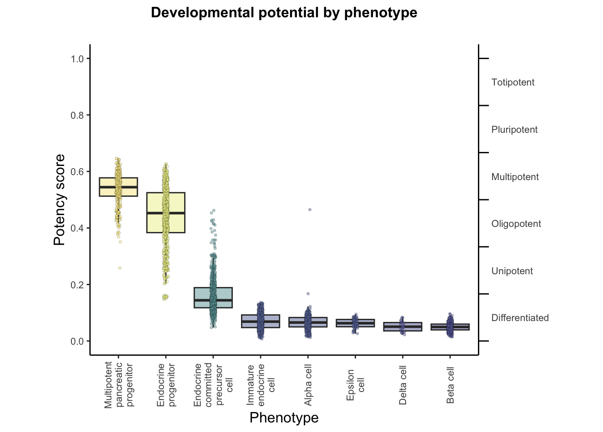
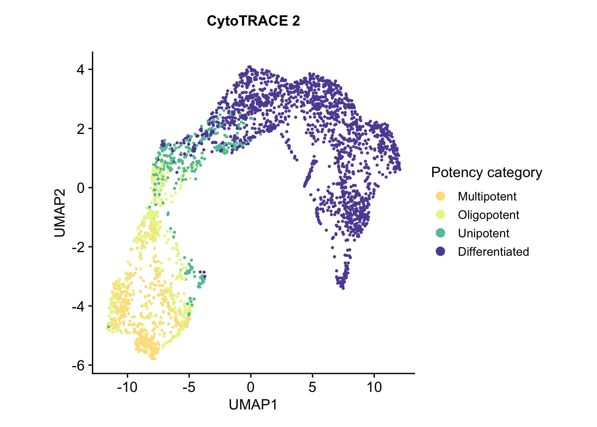
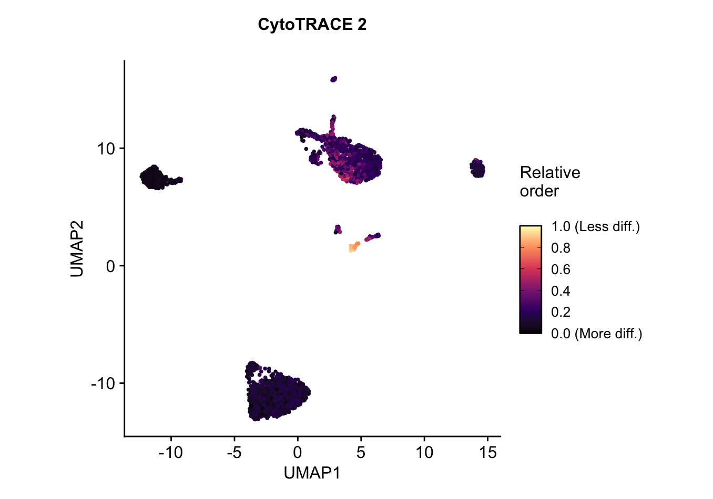

<p align="center">
   
</p>

<h2> <p align="center">
      Prediction of absolute developmental potential <br> using  single-cell expression data
</p> </h2>

**CytoTRACE 2** is a computational method for predicting cellular potency categories and absolute developmental potential from single-cell RNA-sequencing data. 

Potency categories in the context of CytoTRACE 2 classify cells based on their developmental potential, ranging from totipotent and pluripotent cells with broad differentiation potential to lineage-restricted oligopotent, multipotent and unipotent cells capable of producing varying numbers of downstream cell types, and finally, differentiated cells, ranging from mature to terminally differentiated phenotypes.

The predicted potency scores additionally provide a continuous measure of developmental potential, ranging from 0 (differentiated) to 1 (totipotent).

Underlying this method is a novel, interpretable deep learning framework trained and validated across 31 human and mouse scRNA-seq datasets encompassing 28 tissue types, collectively spanning the developmental spectrum. 

This framework learns multivariate gene expression programs for each potency category and calibrates outputs across the full range of cellular ontogeny, facilitating direct cross-dataset comparison of developmental potential in an absolute space. 

<p align="center">
    
</p>

This documentation page details the R package for applying CytoTRACE 2. <strong> For the python package, see <a href="/cytotrace2_python" target="_blank">CytoTRACE 2 Python</a> </strong>.


## Installation


  We recommend installing the CytoTRACE 2 package using the **devtools** package from the R console. If you do not have **devtools** installed, you can install it by running ```install.packages("devtools")``` in the R console.

```R
  devtools::install_github("digitalcytometry/cytotrace2", subdir = "cytotrace2_r") #installing
  library(CytoTRACE2) #loading
```

See alternative installation and package management methods (including an easy-to-use conda environment that precisely solves all dependencies) in the [__Advanced options__](#advanced-options) section below.

NOTE: We recommend using Seurat v4 or later for full compatibility with CytoTRACE 2 package. If you don't have Seurat installed, you can install it by running ```install.packages("Seurat")``` in the R console prior to installing CytoTRACE 2 or use the provided conda environment.

<details><summary>Dependencies</summary>

The following list includes the versions of packages used during the development of CytoTRACE 2. While CytoTRACE 2 is compatible with various (older and newer) versions of these packages, it's important to acknowledge that specific combinations of dependency versions can lead to conflicts. The only such conflict known at this time happens when using Seurat v4 in conjunction with Matrix v1.6. This issue can be resolved by either upgrading Seurat or downgrading Matrix.

``` bash
    R (4.2.3)
    data.table (1.14.8)
    doParallel (1.0.17)
    dplyr (1.1.3)
    ggplot2 (3.4.4)
    HiClimR (2.2.1)
    magrittr (2.0.3)
    Matrix (1.5-4.1)
    parallel (4.2.3)
    plyr (1.8.9)
    RANN (2.6.1)
    Rfast (2.0.8)
    Seurat (4.3.0.1)
    SeuratObject (4.1.3)
    stringr (1.5.1)
  ```

   </details>


## Running CytoTRACE 2 

Running ```CytoTRACE 2``` is easy and straightforward. After loading the library, simply execute the [cytotrace2()](#cyto-trace2) function, with one required input, [__expression data__](#input-files), to obtain [__potency score and potency category__](#cytotrace-2-outputs)  predictions. Subsequently, running [plotData](#plot-data) will generate informative visualizations based on the predicted values, and external annotations, if available. Below, find two vignettes showcasing the application on a mouse dataset and a human dataset.


<details open><summary><span style="font-size: 15px;"><strong>Vignette 1: Development of mouse pancreatic epithelial cells (data table input, ~2 minutes)</strong></span></summary>

To illustrate use of CytoTRACE 2 with a mouse dataset, we will use the dataset Pancreas_10x_downsampled.rds, originally from [Bastidas-Ponce et al., 2019](https://doi.org/10.1242/dev.173849), filtered to cells with known ground truth developmental potential and downsampled, available to download [here](https://drive.google.com/uc?export=download&id=1ivi9TBlmzVTDGzNWQrXXeyL68Wug989K), containing 2 objects:
- expression_data: gene expression matrix for a scRNA-seq (10x Chromium) dataset encompassing 2280 cells from murine pancreatic epithelium
- annotation: phenotype annotations for the scRNA-seq dataset above. 

After downloading the .rds file, we apply CytoTRACE 2 to this dataset as follows:

```r
# download the .rds file (this will download the file to your working directory)
download.file("https://drive.google.com/uc?export=download&id=1ivi9TBlmzVTDGzNWQrXXeyL68Wug989K", "Pancreas_10x_downsampled.rds")

# load rds
data <- readRDS("Pancreas_10x_downsampled.rds")

# extract expression data
expression_data <- data$expression_data

# running CytoTRACE 2 main function - cytotrace2 - with default parameters
cytotrace2_result <- cytotrace2(expression_data)

# extract annotation data
annotation <- data$annotation

# generate prediction and phenotype association plots with plotData function
plots <- plotData(cytotrace2_result = cytotrace2_result, 
                  annotation = annotation,
                  expression_data = expression_data
                  )

```

Expected prediction output, dataframe ```cytotrace2_result``` looks as shown below (can be downloaded from [here](./Vignette1_results.csv)):

<p align="center">
    
</p>


<br>

This dataset contains cells from 4 different embryonic stages of a murine pancreas, and has the following cell types present:
- Multipotent pancreatic progenitors
- Endocrine progenitors and precursors
- Immature endocrine cells
- Alpha, Beta, Delta, and Epsilon cells

<p align="center">
        
</p>

Each of these cell types is at a different stage of development, with progenitors and precursors having varying potential to differentiate into other cell types, and mature cells having no potential for further development. We use CytoTRACE 2 to predict the absolute developmental potential of each cell, which we term as "potency score", as a continuous value ranging from 0 (differentiated) to 1 (stem cells capable of generating an entire multicellular organism). The discrete potency categories that the potency scores cover are ```Differentiated```, ```Unipotent```, ```Oligopotent```, ```Multipotent```, ```Pluripotent```, and ```Totipotent```.

In this case, we would expect to see:
- close to 0 potency scores alpha, beta, delta, and epsilon cells as those are known to be differentiated, 
- scores in the higher mid-range for multipotent pancreatic progenitors as those are known to be multipotent, 
- for endocrine progenitors, precursors and immature cells, the ground truth is not unique, but is in the range for unipotent category. So we would expect to see scores in the lower range for these cells, closer to differentiated.

Visualizing the results we can directly compare the predicted potency scores with the known developmental stage of the cells, seeing how the predictions meticulously align with the known biology. Take a look!

- ***Potency score vs. Ground truth*** 
 <br> UMAP embedding of predicted absolute potency score, which is a continuous value ranging from 0 (differentiated) to 1 (totipotent), binned into discrete potency categories as described [__below__](#cytotrace-2-outputs), indicating the absolute developmental potential of each cell. <br>
  ```bash
  plots$CytoTRACE2_UMAP
  ```

<div align="center">
  <div style="display: flex; justify-content: space-around;">
    
    
  </div>
</div>

<br>


 - <details> <summary> <strong>Other output plots</strong> </summary>
    
    - ***Potency score distribution by phenotype***
    <br> A boxplot of predicted potency score separated by phenotype/group from the annotation file. Can be used to assess the distribution of predicted potency scores across different cell phenotypes. <br>
      ```bash
      plots$CytoTRACE2_Boxplot_byPheno
      ```

      <p align="center">
        
      </p>


    - ***Potency category***
    <br> The UMAP embedding plot of predicted potency category reflects the discrete classification of cells into potency categories, taking possible values of ```Differentiated```, ```Unipotent```, ```Oligopotent```, ```Multipotent```, ```Pluripotent```, and ```Totipotent```. <br>
      ```bash
      plots$CytoTRACE2_Potency_UMAP
      ```
      <p align="center">
        
      </p>

    - ***Relative order***
    <br> UMAP embedding of predicted relative order, which is based on absolute predicted potency scores normalized to the range 0 (more differentiated) to 1 (less differentiated). Provides the relative ordering of cells by developmental potential <br>
      ```bash
      plots$CytoTRACE2_Relative_UMAP
      ```
      <p align="center">
        
      </p>

    - ***Phenotypes***
    <br> UMAP colored by phenotype annotation. Used to assess the distribution of cell phenotypes across the UMAP space. <br>
      ```bash
      plots$Phenotype_UMAP
      ```
      <p align="center">
        
      </p>
</details>

</details>

***Additional specifications***

- By default, CytoTRACE 2 expects mouse data. To provide human data, users should specify ```species = "human"```
- To pass a loaded Seurat object or an .rds file path containing a Seurat object as gene expression input to the ```cytotrace2()``` function, users should specify ```is_seurat = TRUE``` and ```slot_type``` as the name of the assay slot containing the gene expression matrix to use for prediction (can be either ```counts``` or ```data```; default is ```counts```). This will return a Seurat object with metadata containing all CytoTRACE 2 cell potency predictions, which can be further passed to the ```plotData()``` function for visualization with ```is_seurat = TRUE```, as shown in the [__vignette__](#vignette-2:-human-cord-blood-mononuclear-cells-(seurat-object-input,-~2-minutes)) below. 
- By default, CytoTRACE 2 uses a reduced ensemble of 5 models for prediction. To use the full ensemble of 17 models, users should specify ```full_model = TRUE```. More information about the reduced and full model ensembles can be found in the [__Extended usage details__](#extended-usage-details) section below.
- **NOTE**: To reproduce the results in the manuscript, use the following parameters: <br>
      ```full_model = TRUE``` <br>
      ```batch_size = 100000```  <br>
      ```smooth_batch_size = 10000```  <br>
      ```max_pcs = 200``` <br>
      ```seed = 14``` <br>

More details on expected function input files and output objects can be found in [__Input Files__](#input-files) and [__CytoTRACE 2 outputs__](#cytotrace-2-outputs) sections below.

For full usage details with additional options, see the [__Extended usage details__](#extended-usage-details) section below.


<details><summary><span style="font-size: 15px;"><strong>Vignette 2: Human cord blood mononuclear cells (Seurat object input, ~2 minutes) </strong> </span></summary>

To illustrate use of CytoTRACE 2 with a human dataset stored in a Seurat object, we will use the Seurat object Cord_blood_CITE_seq_SeuratObj.rds, originally from [Stoeckius et al., 2017](https://doi.org/10.1038/nmeth.4380), filtered to cells with known ground truth developmental potential and available to download [here](https://drive.google.com/uc?export=download&id=1_OhZdz4y0R0MeB6gNlYAFC8P8rutgqzJ), containing:
- gene expression data for a scRNA-seq (CITE-seq) dataset comprising of 2308 cells. Stored in the RNA assay, 'counts' slot of the Seurat object.
- phenotype annotations for the scRNA-seq dataset above. Stored in the metadata of the Seurat object.

After downloading the .rds file, we apply CytoTRACE 2 to this dataset as follows:


```r
# download the .rds file (this will download the file to your working directory)
download.file("https://drive.google.com/uc?export=download&id=1_OhZdz4y0R0MeB6gNlYAFC8P8rutgqzJ", "Cord_blood_CITE_seq_downsampled_SeuratObj.rds")# load the Seurat object

seurat_obj <- readRDS("Cord_blood_CITE_seq_downsampled_SeuratObj.rds")

# running CytoTRACE 2 main function - cytotrace2
# setting is_seurat = TRUE as input is a Seurat object
# setting slot_type = "counts" as the gene expression data is stored in the "counts" slot of the Seurat object
# setting species = 'human' 
cytotrace2_result <- cytotrace2(seurat_obj, is_seurat = TRUE, slot_type = "counts", species = 'human')

# making an annotation dataframe that matches input requirements for plotData function
annotation <- data.frame(phenotype = seurat_obj@meta.data$standardized_phenotype) %>% set_rownames(., colnames(seurat_obj))

# plotting
plots <- plotData(cytotrace2_result = cytotrace2_result, 
                  annotation = annotation, 
                  is_seurat = TRUE)

```
Expected prediction output ```cytotrace2_result``` is your input Seurat object with predictions added to the metadata.  The predictions in the metadata look as shown below (the resulting Seurat object can be downloaded from [here](./Vignette2_results.rds)):

<p align="center">
    
</p>

Expected plotting outputs: 

- ***Potency score***
<br> UMAP embedding of predicted absolute potency score, which is a continuous value ranging from 0 (differentiated) to 1 (totipotent), indicating the absolute developmental potential of each cell. As expected, hematopoietic stem and progenitor cells have much higher potency compared to other phenotypes, which are mostly mature differentiated cells and are predicted as such.
    ```bash
      plots$CytoTRACE2_UMAP
    ```

  <p align="center">
    
  </p>

- ***Potency category*** 
<br> UMAP embedding of predicted potency category, reflecting the discrete classification of cells into potency categories, taking possible values of ```Differentiated```, ```Unipotent```, ```Oligopotent```, ```Multipotent```, ```Pluripotent```, and ```Totipotent```. As expected, all the cells are predicted to fall in the differentiated category.
  ```bash
  plots$CytoTRACE2_Potency_UMAP
  ```
  <p align="center">
    
  </p>

- ***Relative order***
<br> UMAP embedding of predicted relative order, which is based on absolute predicted potency scores normalized to the range 0 (more differentiated) to 1 (less differentiated). Provides the relative ordering of cells by developmental potential.
  ```bash
  plots$CytoTRACE2_Relative_UMAP
  ```
  <p align="center">
    
  </p>

- ***Phenotypes***
<br> UMAP colored by phenotype annotation. Used to assess the distribution of cell phenotypes across the UMAP space.
  ```bash
  plots$Phenotype_UMAP
  ```
  <p align="center">
    
  </p>

- ***Potency score distribution by phenotype***
<br> A boxplot of predicted potency score separated by phenotype/group from the annotation file. Can be used to assess the distribution of predicted potency scores across different cell phenotypes.
  ```bash
  plots$CytoTRACE2_Boxplot_byPheno
  ```
  <p align="center">
    
  </p>

</details>

</details>

## Input files

<details><summary>Expand section</summary>
  
CytoTRACE 2 requires a single-cell RNA-sequencing gene expression object as input. This can include raw counts, as well as normalized counts, as long as normalization preserves ranking of input gene values within a cell. 
This input can be provided in any of the following formats:

1. **A data table**. This object of class data.frame or data.table should have genes as rows and cells as columns, with row and column names set accordingly.
2. **A filepath to a tab-delimited file**. This file should contain a gene expression matrix with genes as rows and cells as columns. The first row must contain the cell IDs (header), and the first column must contain the gene names that can have a column name or an empty header.
3. **A Seurat object**. This object should contain gene expression values to be used, stored in `object[["RNA"]]@slot_type`, where `slot_type` is the name of the assay slot containing the gene expression matrix to use for prediction (can be either `counts` or `data`). 
4. **A filepath to an .rds file containing a Seurat object**. This file should contain a Seurat object as described in `option 3`.

Please make sure that the input does not contain duplicate gene names or cell IDs.

<p align="center">
    
</p>

CytoTRACE 2 also accepts cell phenotype annotations as an optional input. This is a non-required argument used for plotting outputs, and if provided, will be used to generate UMAP and predicted potency score box plots by phenotype. It should be passed as a loaded dataframe containing cell IDs as rownames and phenotype labels (string formatted without special characters) in the first column. Any additional columns will be ignored.

<p align="center">
    
</p>

</details>

## CytoTRACE 2 outputs

<details><summary>Expand section</summary>

### ```cytotrace2()```

```cytotrace2()``` function returns the CytoTRACE 2 cell potency predictions in a data.frame format. If the gene expression input was provided as a Seurat object or as a filepath to a Seurat object, the results will be returned in the form of a Seurat object with metadata elements containing all CytoTRACE 2 cell potency predictions.

#### CytoTRACE 2 cell potency predictions

For each cell retained following quality control filtering, the CytoTRACE 2 predictions include:

1. *CytoTRACE2_Score*: The final predicted cellular potency score following postprocessing. Possible values are real numbers ranging from 0 (differentiated) to 1 (totipotent), which are binned into potency categories according to the following ranges:
    <div style="text-align: center;">
        <table style="margin-left: auto; margin-right: auto;">
            <tr>
                <td>Range</td>
                <td>Potency</td>
            </tr>
            <tr>
                <td>0 to 1/6</td>
                <td>Differentiated</td>
            </tr>
            <tr>
                <td>1/6 to 2/6</td>
                <td>Unipotent</td>
            </tr>
            <tr>
                <td>2/6 to 3/6</td>
                <td>Oligopotent</td>
            </tr>
            <tr>
                <td>3/6 to 4/6</td>
                <td>Multipotent</td>
            </tr>
            <tr>
                <td>4/6 to 5/6</td>
                <td>Pluripotent</td>
            </tr>
            <tr>
                <td>5/6 to 1</td>
                <td>Totipotent</td>
            </tr>
        </table>
    </div>


2. *CytoTRACE2_Potency*: The final predicted cellular potency category following postprocessing. Possible values are ```Differentiated```, ```Unipotent```, ```Oligopotent```, ```Multipotent```, ```Pluripotent```, and ```Totipotent```. 
3. *CytoTRACE2_Relative*: The predicted relative order of the cell, based on the absolute predicted potency scores, ranked and normalized to the range [0,1] (0 being most differentiated, 1 being least differentiated).
4. *preKNN_CytoTRACE2_Score*: The cellular potency score predicted by the CytoTRACE 2 model before KNN smoothing (see 'binning' in the manuscript).
5. *preKNN_CytoTRACE2_Potency*: The cellular potency category  predicted by the CytoTRACE 2 model before KNN smoothing (see 'binning' in the manuscript). Possible values are ```Differentiated```, ```Unipotent```, ```Oligopotent```, ```Multipotent```, ```Pluripotent```, and ```Totipotent```.


For more details about postprocessing, see the [__Under the hood__](#under-the-hood) section below.

### ```plotData()```

The results of ```plotData()``` are returned as a named list of plots. To access any of the plots simply run ```plots$name_of_the_plot``` (i.e. plots$CytoTRACE2_UMAP).

By default, ```plotData``` produces three plots depicting the UMAP embedding of the input single-cell gene expression data, each colored according to a CytoTRACE 2 output prediction type.

- **Potency category UMAP**: a UMAP colored by predicted potency category (named *CytoTRACE2_UMAP* in the output list)
- **Potency score UMAP**: a UMAP colored by predicted potency score (named *CytoTRACE2_Potency_UMAP* in the output list)
- **Relative order UMAP**: a UMAP colored by predicted relative order (named *CytoTRACE2_Relative_UMAP* in the output list)

If a phenotype annotation file is provided, ```plotData``` will return two more plots.

- **Phenotype UMAP**: a UMAP colored by phenotype annotation (named *Phenotype_UMAP* in the output list)
- **Phenotype potency box plot**: a boxplot of predicted potency score separated by phenotype/group the annotation file (named *CytoTRACE2_Boxplot_byPheno* in the output list)

</details>


## Extended usage details

<details id="cyto-trace2"><summary>cytotrace2</summary>


Required input:

- *input*: Single-cell RNA-seq data, which can be an expression matrix
(rows as genes, columns as cells), a filepath to a tab-separated file containing the data table,
a Seurat object, or the filepath to an .rds file containing a Seurat object.

Optional arguments:

- *species*: String indicating the species name for the gene names in the input data
(options: **"human"** or **"mouse"**, default is **"mouse"**).
- *is_seurat*: Logical indicating whether the input is a Seurat object/filepath to a Seurat object (default is **FALSE**).
- *slot_type*: Character indicating the type of slot to access from "RNA" assay if provided is a Seurat object & is_seurat = TRUE (options: **counts** or **data**, default is  **counts**)
- *parallelize_smoothing*: Logical indicating whether to run the smoothing function
on subsamples in parallel on multiple threads (default is **TRUE**).
- *full_model*: Logical indicating whether to predict based on the full ensemble of 17 models
or a reduced ensemble of 5 most predictive models (default is **FALSE**).
- *parallelize_models*: Logical indicating whether to run the prediction function on
models in parallel on multiple threads (default is **TRUE**).
- *ncores*: Integer indicating the number of cores to utilize when parallelize_models
and/or parallelize_smoothing are TRUE (default is **NULL**; the pipeline detects the number of
available cores and runs on that number; for Windows, it will be set to 1).
- *batch_size*: Integer or NULL indicating the number of cells to subsample for the pipeline steps.
No subsampling if NULL (default is **10000**; recommended for input data size > 10K cells).
- *smooth_batch_size*: Integer or NULL indicating the number of cells to subsample further
within the batch_size for the smoothing step of the pipeline. No subsampling if NULL
(default is **1000**; recommended for input data size > 1K cells).
- *max_pcs*: Integer indicating the maximum number of principal components to use
in the smoothing by kNN step (default is **200**).
- *seed*: Integer specifying the seed for reproducibility in random processes (default is **14**).

Information about these arguments is also available in the function's manual, which can be accessed by running ```help(cytotrace2)``` within an R session.

A typical snippet to run the function with full argument specification on a file path containing human data using the full model ensemble: 

```r
cytotrace2_result <- cytotrace2("path/to/input/expression_file.tsv",
                       species = "human",
                       is_seurat = FALSE,
                       full_model = TRUE,
                       batch_size = 10000,
                       smooth_batch_size = 1000,
                       parallelize_models = TRUE,
                       parallelize_smoothing = TRUE,
                       ncores = NULL,
                       max_pcs = 200,
                       seed = 14)               
```
A typical snippet to run the function with full argument specification on a loaded Seurat object of mouse data using the reduced model ensemble: 

```r
seurat_obj <- loadData("path/to/input/Seurat_object.rds")
cytotrace2_result <- cytotrace2(seurat_obj,   
                  species = "mouse",
                  is_seurat = TRUE,
                  slot_type = "counts",
                  full_model = FALSE,
                  batch_size = 10000,
                  smooth_batch_size = 1000,
                  parallelize_models = TRUE,
                  parallelize_smoothing = TRUE,
                  ncores = NULL,
                  max_pcs = 200,
                  seed = 14)  

```


  - <details><summary>The reduced ensemble model</summary>

    Users can choose to predict based on the full ensemble of 17 models, or a reduced ensemble of 5 models, which are selected based on their high correlation (according to Concordance correlation coefficient (CCC)) with the predictions of the full model. This flexibility allows users to balance computational efficiency with predictive accuracy, tailoring the analysis to their specific needs and dataset characteristics. 

    The selection of the members of the reduced ensemble is done as follows: initially, predictions are generated for the training cohort using pairs of models from all possible combinations of the 17 models. The pair that exhibits the highest CCC with the predictions of the full model is then selected and validated on the test cohort. Subsequently, this selected pair is fixed, and all other models are tested as potential candidates for a 3rd model in the ensemble. The process is iteratively repeated, adding a 4th and 5th model, ultimately arriving at the top 5 models that collectively offer optimal predictive performance. This robust methodology ensures that the reduced ensemble maintains a high correlation with the full model.

    <p align="center">
        
    </p>

    </details>

</details>


<details id="plot-data"><summary>plotData</summary>

Required input:
- *cytotrace2_result*: Output of the cytotrace2 function as described in [_CytoTRACE 2 outputs_](#cytotrace-2-outputs).

Optional input:
- *annotation*: The annotation data (optional, default is ***NULL***, used to prepare phenotype UMAP and box plots)
- *expression_data*: The expression data to be used for plotting (default is ***NULL***, if cytotrace2 is a Seurat object containing expression data and is_seurat = TRUE, can be left NULL).
- *pc_dims*: The number of principal components to use for UMAP visualization (default is ***30***).
- *is_seurat*: Logical, indicating whether the input is a Seurat object (default is ***FALSE***).
- *seed*: Integer specifying the seed for reproducibility in random processes (default is **14**).

A typical snippet to run the function with full argument specification following CytoTRACE 2 prediction: 

```r
annotation <- read.csv('path/to/input/annotation_file.tsv', header = TRUE, row.names = 1)
data <- read.csv('path/to/input/expression_file.tsv', sep = "\t", header = TRUE, row.names = 1)
cytotrace2_result <- cytotrace2(data)
plots <- plotData(cytotrace2_result,
                  annotation = annotation,
                  expression_data = data,
                  is_seurat = FALSE,
                  pc_dims = 30,
                  seed = 14)
```
</details>

## Under the hood 

<details><summary>Expand section</summary> 
  
Underlying CytoTRACE 2 is a novel deep learning framework designed to handle the complexities of single-cell potency assessment while achieving direct biological interpretability. The core of this framework is a set of Gene Set Binary Network (GSBN) modules, in which binary neural networks learn gene sets associated with each potency category. This network was trained over 17 datasets from 18 diverse human and mouse tissues, and the package here relies on an ensemble of these per-dataset trained models. 
<p align="center">
    
</p>
Following initial prediction by the core model, CytoTRACE 2 implements a postprocessing step to leverage the information across transcriptionally similar cells to smooth potency score and correct potency category outliers using a combination of Markov diffusion and k-nearest neighbor smoothing. 
<!-- For more details about the CytoTRACE 2 method, please see the [_associated publication_](#Citation). -->

</details>

## Advanced options

<details><summary>Manual download and installation</summary>

1. You can clone the package folder from the GitHub repository and do local installation using the following commands:
``` bash
  git clone https://github.com/digitalcytometry/cytotrace2.git cytotrace2 #run in terminal to clone the repository
``` 
2. Navigate to `cytotrace2` directory:
    ```bash
      cd cytotrace2
    ```
3. (optional) To ensure your environment contains all the necessary dependencies, you can use the provided conda environment file to create a new environment with all the necessary packages. 
    <details><summary>Expand section</summary>

    1. Install <a href="https://docs.conda.io/projects/conda/en/latest/user-guide/install/index.html" target="_blank">Miniconda</a> if not already available.

    2. (5-10 minutes) Create a conda environment with the required dependencies:
    ```bash
      conda env create -f environment_R.yml
    ```

    3. Activate the `cytotrace2` environment you just created:
    ```bash
      conda activate cytotrace2
    ``` 
   </details>
4. (Activate R from terminal) Load the package into your R environment using the following command:
```R
  devtools::load_all("./cytotrace2_r") #run in R to load into your environment
```
Make sure you specify the path to the subdirectory "cytotrace2_r" within the cloned repository, if you're running outside the cloned repository.

Now you can use the package as described in the [__Running CytoTRACE 2__](#running-cytotrace-2) section.

NOTE: If you are running on a M1/M2 Mac, you may get an error solving the conda environment triggered by issues installing some of the dependencies from conda. To fix that, please try the following:
```bash
    conda create -n cytotrace2
    conda activate cytotrace2
    conda config --env --set subdir osx-64
    conda env update --file environment_R.yml
```

</details>


<details><summary>Updating your local installation</summary>

If you have made local updates to your version of the CytoTRACE 2 source code, you should execute 
```bash
  devtools::load_all()
``` 
in the package folder, before running. 

</details>

## Frequently asked questions

<details><summary>Expand section</summary>

1. **What are the CytoTRACE 2 potency categories?**
CytoTRACE 2 classifies cells into six potency categories:

  - **Totipotent**: Stem cells capable of generating an entire multicellular organism
  - **Pluripotent**: Stem cells with the capacity to differentiate into all adult cell types
  - **Multipotent**: Lineage-restricted multipotent cells capable of producing >3 downstream cell types
  - **Oligopotent**: Linage-restricted immature cells capable of producing 2-3 downstream cell types
  - **Unipotent**: Linage-restricted immature cells capable of producing a single downstream cell type
  - **Differentiated**: Mature cells, including cells with no developmental potential
  
2. **What organism can my data be from?**
CytoTRACE 2 was developed over mouse and human data, and this package accepts data from either. If human data is provided (with ```species = 'human'``` specified), the algorithm will automatically perform an orthology mapping to convert human genes to mouse genes for the CytoTRACE 2 feature set. 

3. **Should I normalize the data before running the main function?**
No normalization is required, but any form of normalization preserving the relative rank of genes within each sample is acceptable. CytoTRACE 2 relies on gene ranks, so any such normalization will not influence results. For the UMAP plots produced by ```plotData```, the input expression is log-normalized unless the maximum value of the input expression matrix is less than 20.

4. **What if I have multiple batches of data? Should I perform any integration?**
No batch integration is required. Instead, we recommend running CytoTRACE 2 separately over each dataset. While raw predictions are made per cell without regard to the broader dataset, the postprocessing step to refine predictions  adjusts predictions using information from other cells in the dataset, and so may be impacted by batch effects. Note that CytoTRACE 2 outputs are calibrated to be comparable across datasets without further adjustment, so no integration is recommended over the predictions either.

5. **Do the R and Python packages produce equivalent output?**
When run without batching (i.e., downsampling the input dataset into batches [or chunks] for parallel processing or to save memory), these packages produce equivalent output. When batching is performed, package outputs will vary, but remain highly correlated in practice.


</details>

</details>


## GitHub package content

<details><summary>cytotrace2_r</summary>

- the main folder of the R package
  - *R*: the subfolder of R scripts
    - *cytotrace2.R*: the main function that executes the pipeline from input to final predictions
    - *plotting.R*: plotting functions based on generated prediction and provided annotation file (if available)
    - *postprocessing.R*: functions used for postprocessing (smoothing, binning, kNN smoothing) raw predicted values
    - *prediction.R*: functions used in the prediction part of the pipeline
    - *preprocess.R*: functions used in loading and processing (orthology mapping, feature selection, feature ranking per cell) input data
  - *inst/extdata*: the subfolder of files internally loaded and used in the pipeline, includes:
    - model parameter matrices (.rds object containing learned parameters of full and reduced models)
    - preselected feature set for the model
    - orthology mapping dictionary (human to mouse)
    - alias mapping dictionary (gene symbol to alias gene symbol)
  - *man*: the subfolder of function manuals
    - can be accessed by ```help(function_name)```
  - *NAMESPACE*: the file containing the package namespace
  - *DESCRIPTION*: the file containing the package description
</details>

<details><summary>cytotrace2_python</summary>

- the <a href="/cytotrace2_python" target="_blank">main folder of the Python scripts and files</a> 
  - *cytotrace2_py*: the subfolder of Python scripts
    - *cytotrace2_py.py*: the main function that executes the pipeline from input to final predictions
    - *resources*: the subfolder of files internally loaded and used in the pipeline, includes:
      - model parameter matrices (.pt objects containing learned parameters of all the ensemble models)
      - preselected feature set for the model
      - human and mouse orthology table from Ensembl
      - alias table from HGNC (gene symbol to alias gene symbol)
      - two R scripts for postprocessing and plotting (smoothDatakNN.R and plot_cytotrace2_results.R), called from the main function.
    - *common*: the subfolder of utility functions used in the pipeline
  - *environment_py.yml*: conda environment file for creating a new environment with all the necessary packages.
  - *setup.py*: the file containing the package description

</details>


## Authors
CytoTRACE 2 was developed in the <a href="https://anlab.stanford.edu/" target="_blank">Newman Lab</a> by Jose Juan Almagro Armenteros, Minji Kang, Gunsagar Gulati, Rachel Gleyzer, Susanna Avagyan, and Erin Brown.

## Contact
If you have any questions, please contact the CytoTRACE 2 team at cytotrace2team@gmail.com.

## License
Please see the <a href="LICENSE" target="_blank">LICENSE</a> file.


## Citation
If you use CytoTRACE 2, please cite: <br>
Minji Kang*, Jose Juan Almagro Armenteros*, Gunsagar S. Gulati*, Rachel Gleyzer, Susanna Avagyan, Erin L. Brown, Wubing Zhang, Abul Usmani, Noah Earland, Zhenqin Wu, James Zou, Ryan C. Fields, David Y. Chen, Aadel A. Chaudhuri, Aaron M. Newman <br>
bioRxiv 2024.03.19.585637; doi: https://doi.org/10.1101/2024.03.19.585637 (preprint)

