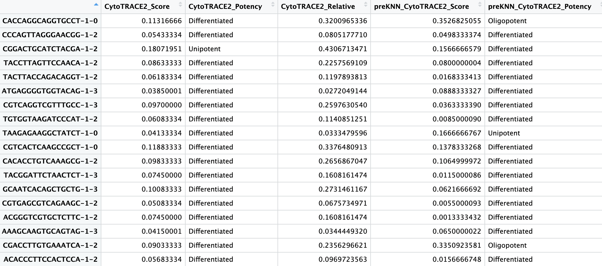
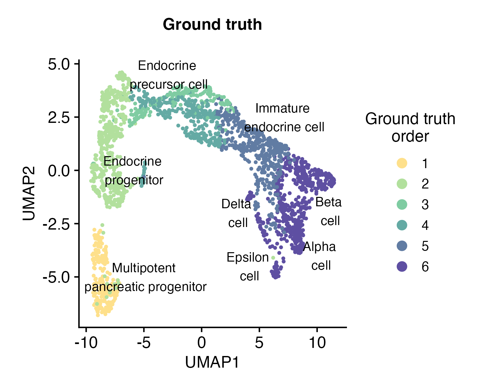
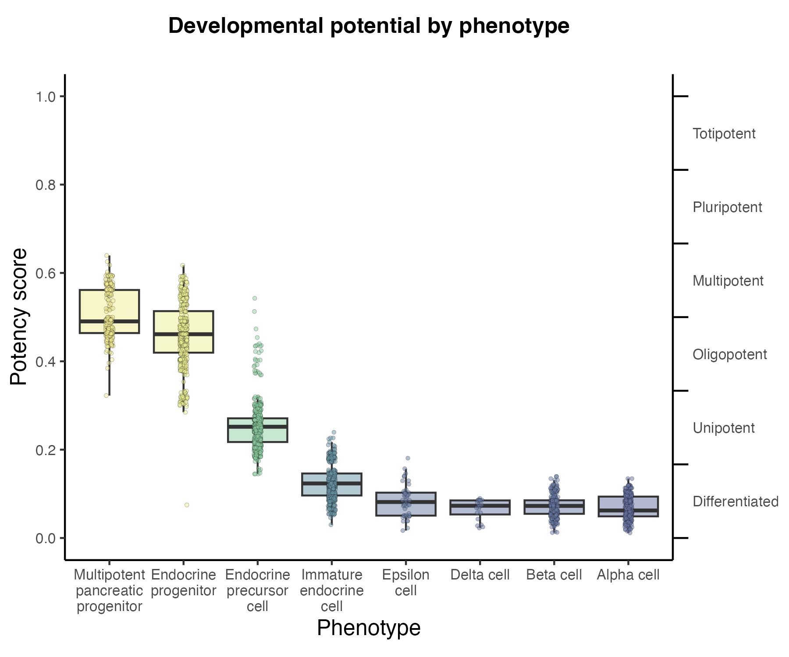
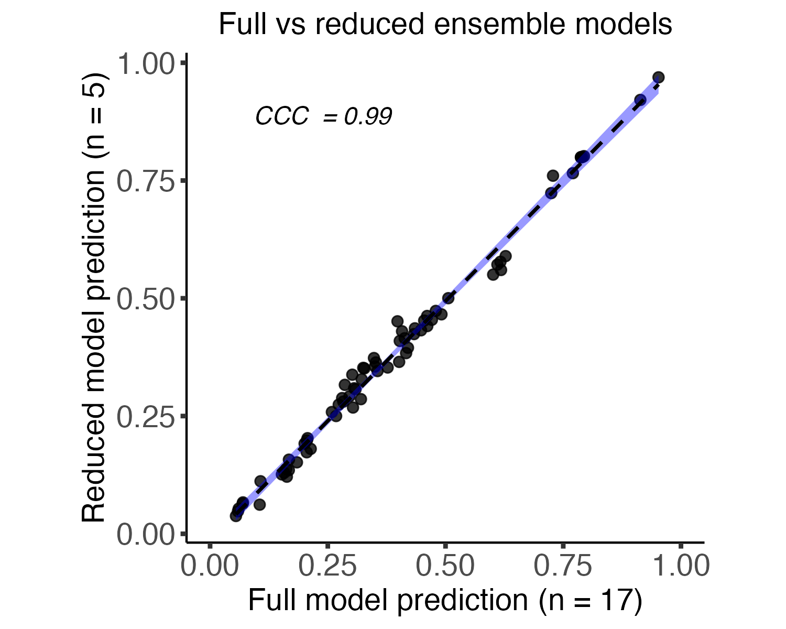

<p align="center">
   
</p>

<h1> <p align="center">
Python package for CytoTRACE 2
</p> </h1>

This documentation page details the Python package for applying CytoTRACE 2.

For the R package implementing CytoTRACE 2, see <a href="/" target="_blank">CytoTRACE 2 R</a>.

## About CytoTRACE 2

<details><summary>Expand section</summary>

CytoTRACE 2 is a computational method for predicting cellular potency categories and absolute developmental potential from single-cell RNA-sequencing data. 

Potency categories in the context of CytoTRACE 2 classify cells based on their developmental potential, ranging from totipotent and pluripotent cells with broad differentiation potential to lineage-restricted oligopotent, multipotent and unipotent cells capable of producing varying numbers of downstream cell types, and finally, differentiated cells, ranging from mature to terminally differentiated phenotypes.

The predicted potency scores additionally provide a continuous measure of developmental potential, ranging from 0 (differentiated) to 1 (totipotent).

Underlying this method is a novel, interpretable deep learning framework trained and validated across 31 human and mouse scRNA-seq datasets encompassing 28 tissue types, collectively spanning the developmental spectrum. 

This framework learns multivariate gene expression programs for each potency category and calibrates outputs across the full range of cellular ontogeny, facilitating direct cross-dataset comparison of developmental potential in an absolute space. 

<p align="center">
    
</p>

</details>


## Installation instructions (10-20 minutes)

<details><summary>Expand section</summary>

1. Install <a href="https://docs.conda.io/projects/conda/en/latest/user-guide/install/index.html" target="_blank">Miniconda</a> if not already available.

2. Clone this repository:
```bash
  git clone https://github.com/digitalcytometry/cytotrace2
```

3. Navigate to `cytotrace2_python` directory:
```bash
  cd cytotrace2/cytotrace2_python
```

4. (10-20 minutes) Create a conda environment with the required dependencies:
```bash
  conda env create -f environment_py.yml
```
Please note that the environment solve time may vary from system to system and may exceed this estimate.

5. Activate the `cytotrace2-py` environment you just created:
```bash
  conda activate cytotrace2-py
```

6. (~30 seconds) Install CytoTRACE 2 by executing:
```bash
  pip install .
```

</details>


## Input files

<details><summary>Expand section</summary>

By default, CytoTRACE 2 requires only a single-cell gene expression file as input. For output plotting, a cell annotation file is accepted as well. All files should be provided in a tab-delimited tabular input format (.txt) with no double quotations. Further formatting details for each input file are specified below. 

__scRNA-seq gene expression file:__
- The table must be genes (rows) by cells (columns).
- The first row must contain the single cell IDs and the first column must contain the gene names.
- The gene expression data can be represented as raw or normalized counts, as long as normalization preserves relative ranking of input gene values within a cell.  
- No instances of duplicate gene or cell names should be present.

<p align="center">
    
</p>

__Cell annotation file:__
- The table should contain two columns, where column 1 contains the single cell IDs corresponding to the columns of the scRNA-seq matrix and column 2 contains the corresponding cell type annotations.
- The columns must have a header. 
- Additional columns beyond the first two will be ignored.

<p align="center">
    
</p>

</details>

## Running CytoTRACE 2 

<details><summary>Expand section</summary>

After activating the `cytotrace2-py` conda environment via `conda activate cytotrace2-py`, CytoTRACE 2 can be called from the command line from any folder using `cytotrace2`.  More examples on how to run CytoTRACE 2 are provided in the [__Example dataset for running CytoTRACE 2__](#example-dataset-for-running-cytotrace-2-2-minutes) section below.

For mouse data with default settings, CytoTRACE 2 would be run as: 
 ```bash
 cytotrace2 \
    --input-path /path/to/cell_expression \
    --annotation-path /path/to/cell_annotations \
    --species mouse
```
Or with more condensed parameter names: 
 ```bash
 cytotrace2 \
    -f /path/to/cell_expression \
    -a /path/to/cell_annotations \
    -sp mouse
```

CytoTRACE 2 can also be called from within a Python script after importing the package.

 ```python
from cytotrace2_py.cytotrace2_py import *

input_path = "/path/to/cell_expression.txt"
example_annotation_path = "/path/to/cell_annotations.txt"
example_species = "human"

results =  cytotrace2(input_path,
                      annotation_path=example_annotation_path,
                      species=example_species)
 ```
</details>

## CytoTRACE 2 outputs

<details><summary>Expand section</summary>

The ```cytotrace2()``` function returns the CytoTRACE 2 cell potency predictions in a data frame format, also saving results and intermediate files to disk.

#### Cell potency predictions

For each cell retained following quality control filtering, the CytoTRACE 2 predictions include:

1. *CytoTRACE2_Score*: The final predicted cellular potency score following postprocessing. Possible values are real numbers ranging from 0 (differentiated) to 1 (totipotent), which are binned into potency categories according to the following ranges:
    <div style="text-align: center;">
        <table style="margin-left: auto; margin-right: auto;">
            <tr>
                <td>Range</td>
                <td>Potency</td>
            </tr>
            <tr>
                <td>0 to 1/6</td>
                <td>Differentiated</td>
            </tr>
            <tr>
                <td>1/6 to 2/6</td>
                <td>Unipotent</td>
            </tr>
            <tr>
                <td>2/6 to 3/6</td>
                <td>Oligopotent</td>
            </tr>
            <tr>
                <td>3/6 to 4/6</td>
                <td>Multipotent</td>
            </tr>
            <tr>
                <td>4/6 to 5/6</td>
                <td>Pluripotent</td>
            </tr>
            <tr>
                <td>5/6 to 1</td>
                <td>Totipotent</td>
            </tr>
        </table>
    </div>


2. *CytoTRACE2_Potency*: The final predicted cellular potency category following postprocessing. Possible values are ```Differentiated```, ```Unipotent```, ```Oligopotent```, ```Multipotent```, ```Pluripotent```, and ```Totipotent```. 
3. *CytoTRACE2_Relative*: The predicted relative order of the cell, based on the absolute predicted potency scores, ranked and normalized to the range [0,1] (0 being most differentiated, 1 being least differentiated).
4. *preKNN_CytoTRACE2_Score*: The cellular potency score predicted by the CytoTRACE 2 model before KNN smoothing (see 'binning' in the manuscript).
5. *preKNN_CytoTRACE2_Potency*: The cellular potency category  predicted by the CytoTRACE 2 model before KNN smoothing (see 'binning' in the manuscript). Possible values are ```Differentiated```, ```Unipotent```, ```Oligopotent```, ```Multipotent```, ```Pluripotent```, and ```Totipotent```.

#### Plots

CytoTRACE 2 outputs are visualized by default in three plots depicting the UMAP embedding of the input single-cell gene expression data, each colored according to a CytoTRACE 2 output prediction type.

- **Potency category UMAP**: a UMAP colored by predicted potency category (*CytoTRACE2_Score_UMAP.pdf*)
- **Potency score UMAP**: a UMAP colored by predicted potency score (*CytoTRACE2_Potency_UMAP.pdf*)
- **Relative order UMAP**: a UMAP colored by predicted relative order (*CytoTRACE2_Relative_UMAP.pdf*)

If a phenotype annotation file is provided, two additional plots will be produced.

- **Phenotype UMAP**: a UMAP colored by phenotype annotation (*CytoTRACE2_Phenotype_UMAP.pdf*)
- **Phenotype potency box plot**: a boxplot of predicted potency score separated by phenotype/group from the annotation file (*CytoTRACE2_box_plot_by_pheno*)

</details>


## Example dataset for running CytoTRACE 2 (~2 minutes)

<details><summary>Expand section</summary>

To illustrate use of CytoTRACE 2, we provide an example mouse pancreas dataset, originally from [Bastidas-Ponce et al., 2019](https://doi.org/10.1242/dev.173849), filtered to cells with known ground truth developmental potential and downsampled.
- Pancreas_10x_downsampled_expression.txt: gene expression matrix for a scRNA-seq (10x Chromium) dataset encompassing 2280 cells from murine pancreatic epithelium (available to download [here](https://drive.google.com/uc?export=download&id=1egcC0NBl6gibBSJNO9on6VwHCvDacMfh)),
- Pancreas_10x_downsampled_annotation.txt: phenotype annotations for the scRNA-seq dataset above (available to download [here](https://drive.google.com/uc?export=download&id=1uRsixzZSTed29qa0AwsHE6tUSodDVXm2)).

After downloading these two files, we apply CytoTRACE 2 to this dataset as follows:

```python
from cytotrace2_py.cytotrace2_py import *

results =  cytotrace2("Pancreas_10x_downsampled_expression.txt",
                      annotation_path="Pancreas_10x_downsampled_annotation.txt",
                      species="mouse")

```

Expected prediction output, dataframe ```results``` looks as shown below (can be downloaded from [here](./cytotrace2_r/inst/extdata/Vignette1_prediction_results.csv)):

<p align="center">
    
</p>


<br>

This dataset contains cells from 4 different embryonic stages of a murine pancreas, and has the following cell types present:
- Multipotent pancreatic progenitors
- Endocrine progenitors and precursors
- Immature endocrine cells
- Alpha, Beta, Delta, and Epsilon cells

<p align="center">
        
</p>

Each of these cell types is at a different stage of development, with progenitors and precursors having varying potential to differentiate into other cell types, and mature cells having no potential for further development. We use CytoTRACE 2 to predict the absolute developmental potential of each cell, which we term as "potency score", as a continuous value ranging from 0 (differentiated) to 1 (stem cells capable of generating an entire multicellular organism). The discrete potency categories that the potency scores cover are ```Differentiated```, ```Unipotent```, ```Oligopotent```, ```Multipotent```, ```Pluripotent```, and ```Totipotent```.

In this case, we would expect to see:
- close to 0 potency scores alpha, beta, delta, and epsilon cells as those are known to be differentiated, 
- scores in the higher mid-range for multipotent pancreatic progenitors as those are known to be multipotent, 
- for endocrine progenitors, precursors and immature cells, the ground truth is not unique, but is in the range for unipotent category. So we would expect to see scores in the lower range for these cells, closer to differentiated.

Visualizing the results we can directly compare the predicted potency scores with the known developmental stage of the cells, seeing how the predictions meticulously align with the known biology. Take a look!

- ***Potency score vs. ground truth*** 
 <br> UMAP embedding of predicted absolute potency score, which is a continuous value ranging from 0 (differentiated) to 1 (totipotent), indicating the absolute developmental potential of each cell. <br>
  ```bash
  plots/CytoTRACE2_Score_UMAP.pdf
  ```

<div align="center">
  <div style="display: flex; justify-content: space-around;">
    
    
  </div>
</div>

<br>


 - <details> <summary> <strong>Other output plots</strong> </summary>
    
    - ***Potency score distribution by phenotype***
    <br> A boxplot of predicted potency score separated by phenotype/group from the annotation file. Can be used to assess the distribution of predicted potency scores across different cell phenotypes. <br>
      ```bash
      plots/CytoTRACE2_box_plot_by_phenotype.pdf
      ```

      <p align="center">
        
      </p>


    - ***Potency category***
    <br> The UMAP embedding plot of predicted potency category reflects the discrete classification of cells into potency categories, taking possible values of ```Differentiated```, ```Unipotent```, ```Oligopotent```, ```Multipotent```, ```Pluripotent```, and ```Totipotent```. <br>
      ```bash
      plots/CytoTRACE2_Potency_UMAP.pdf
      ```
      <p align="center">
        
      </p>

    - ***Relative order***
    <br> UMAP embedding of predicted relative order, which is based on absolute predicted potency scores normalized to the range 0 (more differentiated) to 1 (less differentiated). Provides the relative ordering of cells by developmental potential <br>
      ```bash
      plots/CytoTRACE2_Relative_UMAP.pdf
      ```
      <p align="center">
        
      </p>

    - ***Phenotypes***
    <br> UMAP colored by phenotype annotation. Used to assess the distribution of cell phenotypes across the UMAP space. <br>
      ```bash
      plots/CytoTRACE2_phenotype_UMAP.pdf
      ```
      <p align="center">
        
      </p>
</details>

</details>

## Extended usage details

<details><summary>Expand section</summary>

Key notes:

- By default, CytoTRACE 2 expects mouse data. To provide human data, users should specify ```species = "human"```
- By default, CytoTRACE 2 uses a reduced ensemble of 5 models for prediction. To use the full ensemble of 17 models, users should specify ```full_model = TRUE```. More information about the reduced and full model ensembles can be found in the [__About the ensemble model__](#about-the-ensemble-model) section below.

More details on expected function input files and output objects can be found in [__Input Files__](#input-files) and [__CytoTRACE 2 outputs__](#cytotrace-2-outputs) sections above.

Required input:

- *input_path*: A filepath to a .txt file containing a single-cell RNA-seq gene expression matrix (rows as genes, columns as cells) 

Optional arguments:

- *annotation_path*: A filepath to a .txt file containing phenotype annotations corresponding to the cells of the scRNA-seq expression matrix
- *species*: String indicating the species name for the gene names in the input data
(options: **"human"** or **"mouse"**, default is **"mouse"**).
- *full_model*: Flag indicating whether to predict based on the full ensemble of 17 models
or a reduced ensemble of 5 most predictive models (default is **FALSE**, or absent for the command line).
- *batch_size*: Integer indicating the number of cells to subsample for the pipeline steps (default is **10000**; recommended for input data size > 10K cells).
- *smooth_batch_size*: Integer indicating the number of cells to subsample further
within the batch_size for the smoothing step of the pipeline
(default is **1000**; recommended for input data size > 1K cells).
- *disable_parallelization*: Flag indicating whether to disable parallelization (default is **FALSE**, or absent for the command line).
- *max_cores*: Integer indicating user-provided restriction on the maximum number of CPU cores to use for parallelization (default is **None**, and the number of cores used will then be determined based on system capacity).
- *max_pcs*: Integer indicating the maximum number of principal components to use
in the smoothing by kNN step (default is **200**).
- *seed*: Integer specifying the seed for reproducibility in random processes (default is **14**).
- *output_dir*: Path to the directory to which to save CytoTRACE 2 outputs (default is **cytotrace2_results** in the current working directory).

Information about these arguments is also available in the function's manual, which can be accessed by running ```cytotrace2 -h``` from the command line.

A typical snippet to run the function within Python with full argument specification on a file path containing human data using the full model ensemble: 

```python
result <- cytotrace2("path/to/input/cell_expression.txt",
                       annotation_path = "path/to/input/cell_annotations.txt"
                       species = "mouse",
                       full_model = True,
                       batch_size = 10000,
                       smooth_batch_size = 1000,
                       disable_parallelization = True,
                       max_cores = None,
                       max_pcs = 200,
                       seed = 14)               
```

For the command line, this snippet takes the form:

```python
cytotrace2 --input-path path/to/input/cell_expression.txt \
              --annotation-path /path/to/input/cell_annotations.txt \
              --species mouse \
              --full-model \
              --batch-size 10000 \
              --smooth-batch-size 1000 \
              --disable-parallelization \
              --max-pcs 200 \
              --seed 14 \
              --output-dir /path/to/save/results
```

Or with more condensed parameter names: 

```python
cytotrace2 --f path/to/input/cell_expression.txt \
              --a /path/to/input/cell_annotations.txt \
              --sp mouse \
              --fm \
              --bs 5000 \
              --sbs 1000 \
              --dp \
              --mpc 200 \
              --r 14 \
              --o /path/to/save/results
```

**NOTE**: To reproduce the results in the manuscript, use the following parameters: 
```python
    full_model = True
    batch_size = 100000
    smooth_batch_size = 10000
    max_pcs = 200
    seed = 14
```

### About the ensemble model
<details><summary>Expand section</summary>

Users can choose to predict based on the full ensemble of 17 models, or a reduced ensemble of 5 models, which are selected based on their high correlation (according to Concordance correlation coefficient (CCC)) with the predictions of the full model. This flexibility allows users to balance computational efficiency with predictive accuracy, tailoring the analysis to their specific needs and dataset characteristics. 


The selection of the members of the reduced ensemble is done as follows: initially, predictions are generated for the training cohort using pairs of models from all possible combinations of the 17 models. The pair that exhibits the highest CCC with the predictions of the full model is then selected and validated on the test cohort. Subsequently, this selected pair is fixed, and all other models are tested as potential candidates for a 3rd model in the ensemble. The process is iteratively repeated, adding a 4th and 5th model, ultimately arriving at the top 5 models that collectively offer optimal predictive performance. This robust methodology ensures that the reduced ensemble maintains a high correlation with the full model.

  <p align="center">
      
  </p>


</details>

</details>


## Under the hood 

<details><summary>Expand section</summary> 
  
Underlying CytoTRACE 2 is a novel deep learning framework designed to handle the complexities of single-cell potency assessment while achieving direct biological interpretability. The core of this framework is a set of Gene Set Binary Network (GSBN) modules, in which binary neural networks learn gene sets associated with each potency category. This network was trained over 17 datasets from 18 diverse human and mouse tissues, and the package here relies on an ensemble of these per-dataset trained models. 
<p align="center">
    
</p>
Following initial prediction by the core model, CytoTRACE 2 implements a postprocessing step to leverage the information across transcriptionally similar cells to smooth potency score and correct potency category outliers using a combination of Markov diffusion and k-nearest neighbor smoothing. 
<!-- For more details about the CytoTRACE 2 method, please see the [_associated publication_](#Citation). -->

</details>


## Frequently asked questions

<details><summary>Expand section</summary>

1. **What are the CytoTRACE 2 potency categories?**
CytoTRACE 2 classifies cells into six potency categories:

  - **Totipotent**: Stem cells capable of generating an entire multicellular organism
  - **Pluripotent**: Stem cells with the capacity to differentiate into all adult cell types
  - **Multipotent**: Lineage-restricted multipotent cells capable of producing >3 downstream cell types
  - **Oligopotent**: Linage-restricted immature cells capable of producing 2-3 downstream cell types
  - **Unipotent**: Linage-restricted immature cells capable of producing a single downstream cell type
  - **Differentiated**: Mature cells, including cells with no developmental potential
  
2. **What organism can my data be from?**
CytoTRACE 2 was developed over mouse and human data, and this package accepts data from either. If human data is provided (with ```species = 'human'``` specified), the algorithm will automatically perform an orthology mapping to convert human genes to mouse genes for the CytoTRACE 2 feature set. 

3. **Should I normalize the data before running the main function?**
No normalization is required, but any form of normalization preserving the relative rank of genes within each sample is acceptable. CytoTRACE 2 relies on gene ranks, so any such normalization will not influence results. For the UMAP plots produced by ```plotData```, the input expression is log-normalized unless the maximum value of the input expression matrix is less than 20.

4. **What if I have multiple batches of data? Should I perform any integration?**
No batch integration is required. Instead, we recommend running CytoTRACE 2 separately over each dataset. While raw predictions are made per cell without regard to the broader dataset, the postprocessing step to refine predictions  adjusts predictions using information from other cells in the dataset, and so may be impacted by batch effects. Note that CytoTRACE 2 outputs are calibrated to be comparable across datasets without further adjustment, so no integration is recommended over the predictions either.

5. **Do the R and Python packages produce equivalent output?**
When run without batching (i.e., downsampling the input dataset into batches [or chunks] for parallel processing or to save memory), these packages produce equivalent output. When batching is performed, package outputs will vary, but remain highly correlated in practice.

</details>

</details>


## Authors
CytoTRACE 2 was developed in the <a href="https://anlab.stanford.edu/" target="_blank">Newman Lab</a> by Jose Juan Almagro Armenteros, Minji Kang, Gunsagar Gulati, Rachel Gleyzer, Susanna Avagyan, and Erin Brown.

## Contact
If you have any questions, please contact the CytoTRACE 2 team at cytotrace2team@gmail.com.

## License
Please see the <a href="../LICENSE" target="_blank">LICENSE</a> file.


## Citation
<!-- If you use CytoTRACE 2, please cite: -->
Kang M*, Armenteros JJA*, Gulati GS*, Gleyzer R, Avagyan S, Brown EL, Zhang W, Usmani AS, Earland H, Wu Z, Zou J, Fields RC, Chen DY, Chaudhuri AA, Newman AM (2024) Mapping single-cell developmental potential in health and disease with interpretable deep learning (Submitted).


