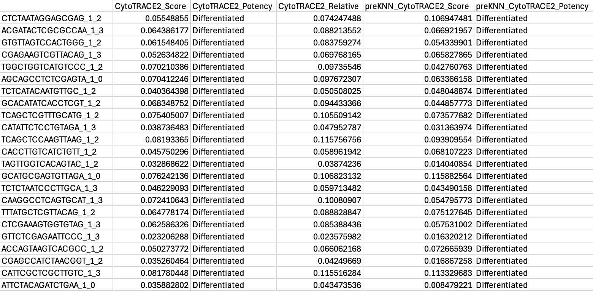

<p align="center">
   
</p>

<h1> <p align="center">
Python package for CytoTRACE 2
</p> </h1>

This documentation page details the Python package for applying CytoTRACE 2.

For the R package implementing CytoTRACE 2, see <a href="/" target="_blank">CytoTRACE 2 R</a>.

## About CytoTRACE 2

<details><summary>Expand section</summary>

CytoTRACE 2 is a computational method for predicting cellular potency categories and absolute developmental potential from single-cell RNA-sequencing data. 

Potency categories in the context of CytoTRACE 2 classify cells based on their developmental potential, ranging from totipotent and pluripotent cells with broad differentiation potential to lineage-restricted oligopotent, multipotent and unipotent cells capable of producing varying numbers of downstream cell types, and finally, differentiated cells, ranging from mature to terminally differentiated phenotypes.

The predicted potency scores additionally provide a continuous measure of developmental potential, ranging from 0 (differentiated) to 1 (totipotent).

Underlying this method is a novel, interpretable deep learning framework trained and validated across 34 human and mouse scRNA-seq datasets encompassing 24 tissue types, collectively spanning the developmental spectrum. 

This framework learns multivariate gene expression programs for each potency category and calibrates outputs across the full range of cellular ontogeny, facilitating direct cross-dataset comparison of developmental potential in an absolute space. 

<p align="center">
    
</p>

</details>


## Installation instructions (10-20 minutes)

<details><summary>Expand section</summary>

1. Install <a href="https://docs.conda.io/projects/conda/en/latest/user-guide/install/index.html" target="_blank">Miniconda</a> if not already available.

2. Clone this repository:
```bash
  git clone https://github.com/digitalcytometry/cytotrace2
```

3. Navigate to `cytotrace2_python` directory:
```bash
  cd cytotrace2/cytotrace2_python
```

4. (10-20 minutes) Create a conda environment with the required dependencies:
```bash
  conda env create -f environment_py.yml
```
Please note that the environment solve time may vary from system to system and may exceed this estimate.

5. Activate the `cytotrace2-py` environment you just created:
```bash
  conda activate cytotrace2-py
```

6. (~30 seconds) Install CytoTRACE 2 by executing:
```bash
  pip install .
```

__Optional:__
For faster data reading, you can optionally install `datatable` (e.g., `pip install datatable` or `conda install -c conda-forge datatable`) if your OS and environment support it. If not installed, the code will default to using `pandas` for reading input files.

</details>


## Input files

<details><summary>Expand section</summary>

By default, CytoTRACE 2 requires only a single-cell gene expression file as input. For output plotting, a cell annotation file is accepted as well. All files should be provided in a tab-delimited tabular input format (.txt) with no double quotations. Further formatting details for each input file are specified below. 

__scRNA-seq gene expression file:__
- The table must be genes (rows) by cells (columns).
- The first row must contain the single cell IDs and the first column must contain the gene names.
- The gene expression data can be represented as raw or CPM/TPM normalized counts, but should not be log-transformed.  
- No instances of duplicate gene or cell names should be present.

<p align="center">
    
</p>

__Cell annotation file:__
- The table should contain two columns, where column 1 contains the single cell IDs corresponding to the columns of the scRNA-seq matrix and column 2 contains the corresponding cell type annotations.
- The columns must have a header. 
- Additional columns beyond the first two will be ignored.

<p align="center">
    
</p>

</details>

## Running CytoTRACE 2 

<details><summary>Expand section</summary>

After activating the `cytotrace2-py` conda environment via `conda activate cytotrace2-py`, CytoTRACE 2 can be called from the command line from any folder using `cytotrace2`.  More examples on how to run CytoTRACE 2 are provided in the [__Example dataset for running CytoTRACE 2__](#example-dataset-for-running-cytotrace-2-2-minutes) section below.

For mouse data with default settings, CytoTRACE 2 would be run as: 
 ```bash
 cytotrace2 \
    --input-path /path/to/cell_expression \
    --annotation-path /path/to/cell_annotations \
    --species mouse
```
Or with more condensed parameter names: 
 ```bash
 cytotrace2 \
    -f /path/to/cell_expression \
    -a /path/to/cell_annotations \
    -sp mouse
```

CytoTRACE 2 can also be called from within a Python script after importing the package.

 ```python
from cytotrace2_py.cytotrace2_py import *

input_path = "/path/to/cell_expression.txt"
example_annotation_path = "/path/to/cell_annotations.txt"
example_species = "human"

results =  cytotrace2(input_path,
                      annotation_path=example_annotation_path,
                      species=example_species)
 ```
</details>

## CytoTRACE 2 outputs

<details><summary>Expand section</summary>

The ```cytotrace2()``` function returns the CytoTRACE 2 cell potency predictions in a data frame format, also saving results and intermediate files to disk.

#### Cell potency predictions

For each cell retained following quality control filtering, the CytoTRACE 2 predictions include:

1. *CytoTRACE2_Score*: The final predicted cellular potency score following postprocessing. Possible values are real numbers ranging from 0 (differentiated) to 1 (totipotent), which are binned into potency categories according to the following ranges:
    <div style="text-align: center;">
        <table style="margin-left: auto; margin-right: auto;">
            <tr>
                <td>Range</td>
                <td>Potency</td>
            </tr>
            <tr>
                <td>0 to 1/6</td>
                <td>Differentiated</td>
            </tr>
            <tr>
                <td>1/6 to 2/6</td>
                <td>Unipotent</td>
            </tr>
            <tr>
                <td>2/6 to 3/6</td>
                <td>Oligopotent</td>
            </tr>
            <tr>
                <td>3/6 to 4/6</td>
                <td>Multipotent</td>
            </tr>
            <tr>
                <td>4/6 to 5/6</td>
                <td>Pluripotent</td>
            </tr>
            <tr>
                <td>5/6 to 1</td>
                <td>Totipotent</td>
            </tr>
        </table>
    </div>


2. *CytoTRACE2_Potency*: The final predicted cellular potency category following postprocessing. Possible values are ```Differentiated```, ```Unipotent```, ```Oligopotent```, ```Multipotent```, ```Pluripotent```, and ```Totipotent```. 
3. *CytoTRACE2_Relative*: The predicted relative order of the cell, based on the absolute predicted potency scores, normalized to the range [0,1] (0 being most differentiated, 1 being least differentiated).
4. *preKNN_CytoTRACE2_Score*: The cellular potency score predicted by the CytoTRACE 2 model before KNN smoothing (see 'binning' in the manuscript).
5. *preKNN_CytoTRACE2_Potency*: The cellular potency category  predicted by the CytoTRACE 2 model before KNN smoothing (see 'binning' in the manuscript). Possible values are ```Differentiated```, ```Unipotent```, ```Oligopotent```, ```Multipotent```, ```Pluripotent```, and ```Totipotent```.

#### Plots

CytoTRACE 2 outputs are visualized by default in three plots depicting the UMAP embedding of the input single-cell gene expression data, each colored according to a CytoTRACE 2 output prediction type.

- **Potency category UMAP**: a UMAP colored by predicted potency category (*CytoTRACE2_Score_UMAP.pdf*)
- **Potency score UMAP**: a UMAP colored by predicted potency score (*CytoTRACE2_Potency_UMAP.pdf*)
- **Relative order UMAP**: a UMAP colored by predicted relative order (*CytoTRACE2_Relative_UMAP.pdf*)

If a phenotype annotation file is provided, two additional plots will be produced.

- **Phenotype UMAP**: a UMAP colored by phenotype annotation (*CytoTRACE2_Phenotype_UMAP.pdf*)
- **Phenotype potency box plot**: a boxplot of predicted potency score separated by phenotype/group from the annotation file (*CytoTRACE2_box_plot_by_pheno.pdf*)

</details>


## Example dataset for running CytoTRACE 2 (~2 minutes)

<details><summary>Expand section</summary>

To illustrate use of CytoTRACE 2, we provide an example mouse pancreas dataset, originally from [Bastidas-Ponce et al., 2019](https://doi.org/10.1242/dev.173849), filtered to cells with known ground truth developmental potential and downsampled.
- Pancreas_10x_downsampled_expression.txt: gene expression matrix for a scRNA-seq (10x Chromium) dataset encompassing 2280 cells from murine pancreatic epithelium (available to download [here](https://drive.google.com/file/d/11eI1gSBoBqn9ccvBbthZ2nPW3CENsKbT/view?usp=drive_link)),
- Pancreas_10x_downsampled_annotation.txt: phenotype annotations for the scRNA-seq dataset above (available to download [here](https://drive.google.com/file/d/1UESeZJDl2qWYnSu0VQQA5igpEbtxZPgq/view?usp=drive_link)).

After downloading these two files, we apply CytoTRACE 2 to this dataset as follows:

```python
from cytotrace2_py.cytotrace2_py import *

results =  cytotrace2("Pancreas_10x_downsampled_expression.txt",
                      annotation_path="Pancreas_10x_downsampled_annotation.txt",
                      species="mouse")

```

Expected prediction output, dataframe ```results``` looks as shown below (can be downloaded from [here]((https://drive.google.com/file/d/13gdepThDjpxFh-EByta52cLDovLxU8YI/view?usp=drive_link)):

<p align="center">
    
</p>


<br>

This dataset contains cells from 4 different embryonic stages of a murine pancreas, and has the following cell types present:
- Multipotent pancreatic progenitors
- Endocrine progenitors and precursors
- Immature endocrine cells
- Alpha, Beta, Delta, and Epsilon cells

<p align="center">
        
</p>

Each of these cell types is at a different stage of development, with progenitors and precursors having varying potential to differentiate into other cell types, and mature cells having no potential for further development. We use CytoTRACE 2 to predict the absolute developmental potential of each cell, which we term as "potency score", as a continuous value ranging from 0 (differentiated) to 1 (stem cells capable of generating an entire multicellular organism). The discrete potency categories that the potency scores cover are ```Differentiated```, ```Unipotent```, ```Oligopotent```, ```Multipotent```, ```Pluripotent```, and ```Totipotent```.

In this case, we would expect to see:
- potency scores close to 0 for alpha, beta, delta, and epsilon cells as these are known to be differentiated
- scores in the higher mid-range for multipotent pancreatic progenitors as these are known to be multipotent
- scores in the lower range for endocrine progenitors, precursors and immature cells; the ground truth is not unique, but is in the range for unipotent category

Visualizing the results we can directly compare the predicted potency scores with the known developmental stage of the cells, seeing how the predictions meticulously align with the known biology. Take a look!

- ***Potency score vs. ground truth*** 
 <br> UMAP embedding of predicted absolute potency score, which is a continuous value ranging from 0 (differentiated) to 1 (totipotent), indicating the absolute developmental potential of each cell. <br>
  ```bash
  plots/CytoTRACE2_Score_UMAP.pdf
  ```

<div align="center">
  <div style="display: flex; justify-content: space-around;">
    
    
  </div>
</div>

<br>


 - <details> <summary> <strong>Other output plots</strong> </summary>
    
    - ***Potency score distribution by phenotype***
    <br> A boxplot of predicted potency score separated by phenotype/group from the annotation file. Can be used to assess the distribution of predicted potency scores across different cell phenotypes. <br>
      ```bash
      plots/CytoTRACE2_potency_score_by_phenotype.pdf
      ```

      <p align="center">
        
      </p>


    - ***Potency category***
    <br> The UMAP embedding plot of predicted potency category reflects the discrete classification of cells into potency categories, taking possible values of ```Differentiated```, ```Unipotent```, ```Oligopotent```, ```Multipotent```, ```Pluripotent```, and ```Totipotent```. <br>
      ```bash
      plots/CytoTRACE2_potency_category_UMAP.pdf
      ```
      <p align="center">
        
      </p>

    - ***Relative order***
    <br> UMAP embedding of predicted relative order, which is based on absolute predicted potency scores normalized to the range 0 (more differentiated) to 1 (less differentiated). Provides the relative ordering of cells by developmental potential <br>
      ```bash
      plots/CytoTRACE2_relative_order_UMAP.pdf
      ```
      <p align="center">
        
      </p>

    - ***Phenotypes***
    <br> UMAP colored by phenotype annotation. Used to assess the distribution of cell phenotypes across the UMAP space. <br>
      ```bash
      plots/CytoTRACE2_phenotype_UMAP.pdf
      ```
      <p align="center">
        
      </p>
</details>

</details>

## Extended usage details

<details><summary>Expand section</summary>

Key notes:

- By default, CytoTRACE 2 expects mouse data. To provide human data, users should specify ```species = "human"```

More details on expected function input files and output objects can be found in [__Input Files__](#input-files) and [__CytoTRACE 2 outputs__](#cytotrace-2-outputs) sections above.

Required input:

- *input_path*: A filepath to a .txt file containing a single-cell RNA-seq gene expression matrix (rows as genes, columns as cells) 

Optional arguments:

- *annotation_path*: A filepath to a .txt file containing phenotype annotations corresponding to the cells of the scRNA-seq expression matrix
- *species*: String indicating the species name for the gene names in the input data
(options: **"human"** or **"mouse"**, default is **"mouse"**).
- *batch_size*: Integer indicating the number of cells to process at once for the pipeline steps, including subsampling for KNN smoothing (default is **10000**).
- *smooth_batch_size*: Integer indicating the number of cells to subsample further
within the batch_size for the smoothing by diffusion step of the pipeline
(default is **1000**).
- *disable_parallelization*: Flag indicating whether to disable parallelization (default is **FALSE**, or absent for the command line).
- *disable_plotting*: Flag indicating whether to disable plotting (default is **FALSE**, or absent for the command line). To plot results, data are reprocessed following the core CytoTRACE 2 pipeline to produce UMAP embeddings via a standard scanpy pipeline. As this step can be time-consuming, we provide the option to disable it if desired.
- *max_cores*: Integer indicating user-provided restriction on the maximum number of CPU cores to use for parallelization (default is **None**, and the number of cores used will then be determined based on system capacity; when running on computers with less than 16GB memory, we recommend reducing it to 1 or 2 to avoid memory issues.).
- *seed*: Integer specifying the seed for reproducibility in random processes (default is **14**).
- *output_dir*: Path to the directory to which to save CytoTRACE 2 outputs (default is **cytotrace2_results** in the current working directory).

Information about these arguments is also available in the function's manual, which can be accessed by running ```cytotrace2 -h``` from the command line.

A typical snippet to run the function within Python with full argument specification on a file path containing human data: 

```python
result = cytotrace2("path/to/input/cell_expression.txt",
                       annotation_path = "path/to/input/cell_annotations.txt",
                       species = "human",
                       batch_size = 10000,
                       smooth_batch_size = 1000,
                       disable_plotting = False,
                       disable_parallelization = False,
                       max_cores = None,
                       seed = 14)               
```

For the command line, this snippet takes the form:

```bash
cytotrace2 --input-path path/to/input/cell_expression.txt \
              --annotation-path /path/to/input/cell_annotations.txt \
              --species human \
              --batch-size 10000 \
              --smooth-batch-size 1000 \
              --seed 14 \
              --output-dir /path/to/save/results
```

Or with more condensed parameter names: 

```bash
cytotrace2 --f path/to/input/cell_expression.txt \
              --a /path/to/input/cell_annotations.txt \
              --sp human \
              --fm \
              --bs 10000 \
              --sbs 1000 \
              --r 14 \
              --o /path/to/save/results
```

To run the same snippet but disabling parallelization and plotting, you would run the following within Python:

```python
result = cytotrace2("path/to/input/cell_expression.txt",
                       annotation_path = "path/to/input/cell_annotations.txt",
                       species = "human",
                       batch_size = 10000,
                       smooth_batch_size = 1000,
                       disable_plotting = False,
                       disable_parallelization = False,
                       max_cores = None,
                       seed = 14)               
```

and the following from the command line:

```bash
cytotrace2 --input-path path/to/input/cell_expression.txt \
              --annotation-path /path/to/input/cell_annotations.txt \
              --species human \
              --batch-size 10000 \
              --smooth-batch-size 1000 \
              --seed 14 \
              --disable-plotting \
              --disable-parallelization \
              --output-dir /path/to/save/results
```

or:

```bash
cytotrace2 --f path/to/input/cell_expression.txt \
              --a /path/to/input/cell_annotations.txt \
              --sp human \
              --fm \
              --bs 10000 \
              --sbs 1000 \
              --r 14 \
              --dpl \
              --dpa \
              --o /path/to/save/results
```

**NOTE**: To reproduce the results in the manuscript, please be sure to use the following parameters: 
```python
    batch_size = 100000
    smooth_batch_size = 10000
    seed = 14
```
</details>

## Under the hood 

<details><summary>Expand section</summary> 
  
Underlying CytoTRACE 2 is a novel deep learning framework designed to handle the complexities of single-cell potency assessment while achieving direct biological interpretability. The core of this framework is a set of Gene Set Binary Network (GSBN) modules, in which binary neural networks learn gene sets associated with each potency category. This network was trained over 17 datasets from 18 diverse human and mouse tissues, and the package here relies on an ensemble of these per-dataset trained models. 
<p align="center">
    
</p>
Following initial prediction by the core model, CytoTRACE 2 implements a postprocessing step to leverage the information across transcriptionally similar cells to smooth potency score and correct potency category outliers using a combination of Markov diffusion and adaptive nearest neighbor smoothing. 
<!-- For more details about the CytoTRACE 2 method, please see the [_associated publication_](#Citation). -->

</details>


## Frequently asked questions

<details><summary>Expand section</summary>

1. **What are the CytoTRACE 2 potency categories?**
CytoTRACE 2 classifies cells into six potency categories:

  - **Totipotent**: Stem cells capable of generating an entire multicellular organism
  - **Pluripotent**: Stem cells with the capacity to differentiate into all adult cell types
  - **Multipotent**: Lineage-restricted multipotent cells capable of producing >3 downstream cell types
  - **Oligopotent**: Lineage-restricted immature cells capable of producing 2-3 downstream cell types
  - **Unipotent**: Lineage-restricted immature cells capable of producing a single downstream cell type
  - **Differentiated**: Mature cells, including cells with no developmental potential
  
2. **What organism can my data be from?**

    CytoTRACE 2 was developed over mouse and human data, and this package accepts data from either. If human data is provided (with ```species = 'human'``` specified), the algorithm will automatically perform an orthology mapping to convert human genes to mouse genes for the CytoTRACE 2 feature set. 

3. **Should I normalize the data before running the main function?**

    There is no need to normalize data prior to running CytoTRACE 2, provided there are no missing values and all values are non-negative. The input needs to be **raw counts or CPM/TPM normalized counts, and should not be log-transformed**.

4. **What if I have multiple batches of data? Should I perform any integration?**

    No batch integration is required. Instead, we recommend running CytoTRACE 2 separately over each dataset. While raw predictions are made per cell without regard to the broader dataset, the postprocessing step to refine predictions adjusts predictions using information from other cells in the dataset, and so may be impacted by batch effects. Note that CytoTRACE 2 outputs are calibrated to be comparable across datasets without further adjustment, so no integration is recommended over the predictions either.

5. **Do the R and Python packages produce equivalent output?**

    When run without batching (i.e., downsampling the input dataset into batches [or chunks] for parallel processing or to save memory), these packages produce equivalent output. When batching is performed, package outputs will vary, but remain highly correlated in practice. Please note that processing for UMAP embeddings is implemented via a standard Seurat pipeline for the R package and a standard scanpy pipeline for the Python package. As a result, UMAP embeddings will differ between packages, even when predicted potency scores match exactly.

6. **What strategies are recommended for managing very large datasets (>100K cells) with CytoTRACE 2?**

    For large datasets, subdividing the data into smaller segments, each containing up to 100,000 cells, is advisable. This division not only facilitates more efficient memory management and processing but also preserves the integrity of your analysis. Depending on the dataset’s characteristics, you can segment by experimental conditions (technical batches) or samples. Additionally, when choosing your subset size, please be mindful of the computational resources available to you--some systems may support ~100,000 cells while for others, a further reduced subset size may be preferable.

7. **What if my dataset has rare cell types?**

    CytoTRACE 2 implements an adaptive nearest neighbor smoothing step as the final component of postprocessing. When analyzing phenotypes expected to have five or fewer cells, we recommend bypassing the KNN smoothing step so that predictions for these rare cells are not forced toward more abundant phenotypes. In practice, you can simply use the preKNN score output (preKNN_CytoTRACE2_Score) instead of the final KNN-smoothed value (CytoTRACE2_Score).


8. **Does CytoTRACE 2's performance depend on the number of UMI/gene counts per cell?**

    Although generally insensitive to variation in gene/UMI counts per cell, CytoTRACE 2 requires further optimization for cells that have exceedingly low gene expression levels, particularly those with fewer than 500 genes expressed per cell, as its performance can become less reliable in these cases. For best results, **a minimum gene count of 500-1000 per cell is recommended.**

</details>


## Authors
CytoTRACE 2 was developed in the <a href="https://anlab.stanford.edu/" target="_blank">Newman Lab</a> by Minji Kang, Erin Brown, Jose Juan Almagro Armenteros, Gunsagar Gulati, Rachel Gleyzer, and Susanna Avagyan.

## Contact
If you have any questions, please contact the CytoTRACE 2 team at cytotrace2team@gmail.com.

## License
Please see the <a href="../LICENSE" target="_blank">LICENSE</a> file.


## Citation
<!-- If you use CytoTRACE 2, please cite: -->
Minji Kang*, Gunsagar S. Gulati*, Erin L. Brown*, Jose Juan Almagro Armenteros*, Rachel Gleyzer*, Zhen Qi*, Susanna Avagyan, Wubing Zhang, Chloé B. Steen, Jeremy D’Silva, Janella Schwab, Abul Usmani, Noah Earland, Zhenqin Wu, James Zou, Ryan C. Fields, David Y. Chen, Michael F. Clarke, Aadel A. Chaudhuri, and Aaron M. Newman. Mapping single-cell developmental potential in health and disease with interpretable deep learning.
bioRxiv 2024.03.19.585637; doi: https://doi.org/10.1101/2024.03.19.585637 (preprint)

